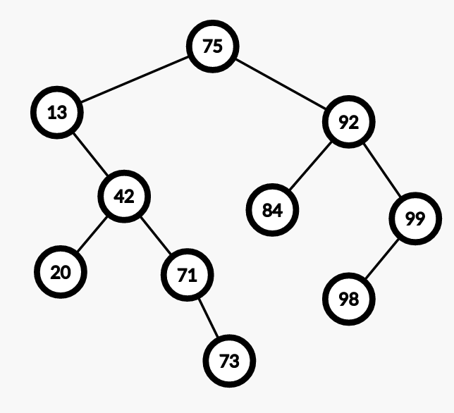

#### 1. Hash Tables: Data Structure Invariants

##### (a) 

- **Q:** Extend `is_ht` from above, adding code to check that every element in the hash table matches the chain it is located in, and that each chain is non-cyclic.

- **A:** 

  ```clike
  bool is_ht(ht H) {
    if (H == NULL) return false;
    if (!(H->m > 0)) return false;
    if (!(H->n >= 0)) return false;
    //@assert H->m == \length(H->table);
    int nodecount = 0;
    for (int i = 0; i < H->m; i++)
    {
      // set p equal to a pointer to first node
      // of chain i in table, if any
      chain* p = H->table[i];
      while (p != NULL)
      {
        elem e = p->data;
        if ((e == NULL) || (abs(hash(elem_key(e)) % H->m) != i))
          return false;
        nodecount++;
        if (nodecount > H->n)
          return false;
        p = p->next;
      }
    }
    if (nodecount != H->n)
      return false;
    return true;
  }
  ```

##### (b)

- **Q:** Give a simple postcondition for this function.

- **A:** 

  ```clike
  /*@ensures \result == NULL
             || key_equal(k, elem_key(\result));
  @*/
  ```


#### 2. Binary Search Trees

##### (a)

- **Q:** Draw the binary search tree that results from inserting the following keys in the order given:

  ` 75 92 99 13 84 42 71 98 73 20`

- **A:**

  

##### (b)

- **Q:**  How many different binary search trees can be constructed using the following five keys: `73, 28, 52, -9, 104` if they can inserted in any arbitrary order?

- **A:** 对于任意的二叉树结构，依据其中序遍历可以用这些数构建一颗合法的 BST，那么问题就转化为有多少种含 $5$ 个节点的 二叉树。

  对于这个问题，已经被系统的研究过，答案即是卡特兰数（尽管它还有其他意义）。
  $$
  Catalan(n) = \sum_{i=0}^{n-1}Catalan(i)\cdot Catalan(n-1-i)\\
  Catalan(0) = 1\\
  $$
  可以理解为，含有 $n$ 个节点的二叉树个数，可以由枚举合法的左右子树的所有节点数，由定义通过递归来计算出来。$Catalan(5) = 42$，一共可以构造 $42$ 个合法的 BST。

##### (c)

- **Q:** Write an implementation of a new library function, `bst_height`, that returns the height of a binary search tree. The height of a binary search tree is defined as the maximum number of nodes as you follow a path from the root to a leaf. As a result, the height of an empty binary search tree is 0. Your function must include a **recursive** helper function `tree_height`.

- **A:**

  ```clike
  int tree_height(tree* T)
  //@requires is_ordered(T, NULL, NULL);
  {
      if (T == NULL) return 0;
      int left_height = tree_height(T->left);
      int right_height = tree_height(T->right);
      if (left_height > right_height)
          return left_height + 1;
      else
          return right_height + 1;
  }
  
  int bst_height(bst B)
  //@requires is_bst(B);
  //@ensures is_bst(B);
  {
         return tree_height(B->root);
  }
  ```

##### (d)

- **Q:** Consider extending the BST library implementation with the following function which deletes an element from the tree with the given key.

  ```clike
  void bst_delete(bst B, key k)
  //@requires is_bst(B);
  //@ensures is_bst(B);
  {
          B->root = tree_delete(B->root, key k);
  }
  ```

  Complete the code for the recursive helper function `tree_delete` which is used by the `bst_delete` function. This function should return a pointer to the tree rooted at `T` once the key is deleted (if it is in the tree).

  You will need to complete an additional helper function `largest_child` that removes and returns the largest child rooted at a given tree node T.

- **A:**

  ```clike
  tree* tree_delete(tree* T, key k)
  {
      if (T == NULL) {   	               // key is not in the tree
          return NULL;
      }
      if (key_compare(k, elem_key(T->data)) < 0) {
         T->left = tree_delete(T->left, k);
         return T;
      } else if (key_compare(k, elem_key(T->data)) > 0) {
         T->right = tree_delete(T->right, k);
         return T;
      } else {      // key is in current tree node T
          if (T->left == NULL)        // node has only right child
              return T->right;
          else if (T->right == NULL)   // node has only left child
              return T->left;
          else {         // Node to be deleted has two children
              if (T->left->right == NULL) {
                  // Replace the data in T with the data
                  // in the left child.
                  T->data = T->left->data;
                  // Replace the left child with its left child.
                  T->left = T->left->left;
                 return T;
              }
              else {
                  // Search for the largest child in the
                  // left subtree of T and replace the data
                  // in node T with this data after removing
                  // the largest child in the left subtree.
                  T->data = largest_child(T->left);
                  return T;
              }
          }
      }
  }
  
  elem largest_child(tree* T)
  //@requires T != NULL && T->right != NULL;
  {
      if (T->right->right == NULL) {
          elem e = T->right->data;
          T->right = T->right->left;
          return e;
      }
      return largest_child(T->right);
  }
  
  ```

  