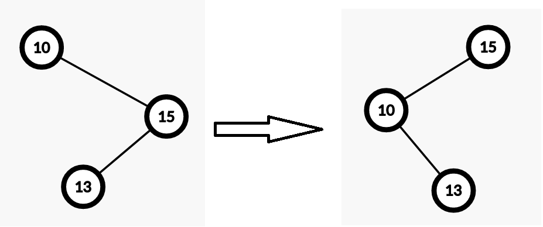
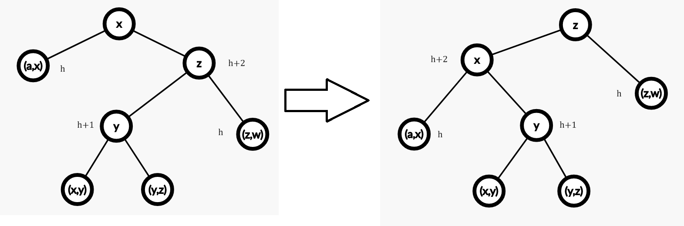
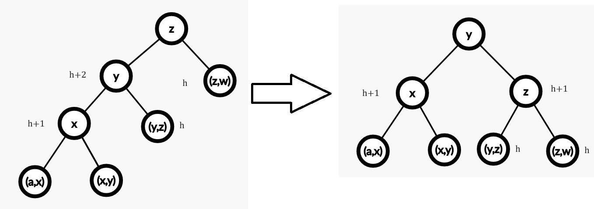
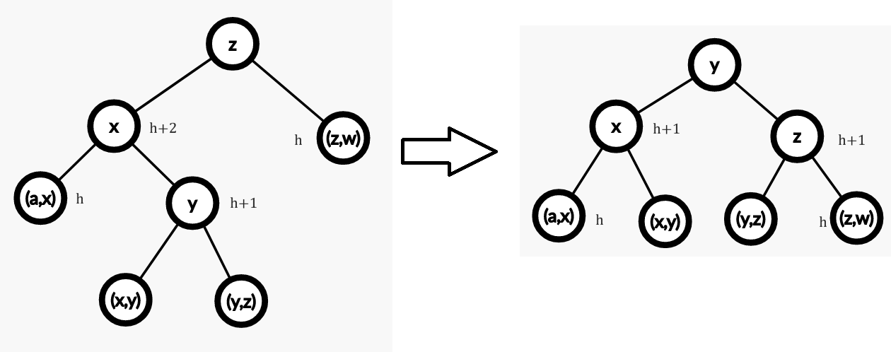

#### **练习** 1

- **Q:** 证明在第 $5$ 节的第二种情况下，一次左旋不一定会恢复高度不变性。

- **A:** 例如，向 AVL 树中依次插入`10 15 13`，单独一次左旋会把树变成“对称”的样子，不会恢复不变性。

  

  更一般地，假定 AVL 树中 $x<y<z$，其中 `z` 是 `x` 的右儿子，`y` 是 `z` 的左儿子，向 `y` 所在子树中插入节点使得 `x` 处不满足左右子树高度要求。假定原来 `x` 的左子树高度为 $h$，`x` 的右子树（即以 `z` 为根的子树）高度为 $h+1$，原来 `z` 的左子树（即以 `y` 为根的子树）高度为 $h$，`z` 的右子树高度为 $h$。假定插入节点之后，`z` 的左子树（即以 `y` 为根的子树）高度为 $h+1$，`z` 的右子树高度为 $h$，`x` 的左子树高度为 $h$，`x` 的右子树（即以 `z` 为根的子树）高度为 $h+2$。这个情况下，`z` 满足左右子树高度限制，`x` 不满足。

  

  在进行一次左旋之后，`x` 的右子树变为了 `z` 的左子树（即以 `y` 为根的子树），`z` 的左子树变为了以 `x` 为根的子树。此时，`x` 的左子树高度为 $h$，`x` 的右子树（即以 `y` 为根的子树）高度为 $h+1$，`z` 的左子树（即以 `x` 为根的子树）高度为 $h+2$，`z` 的右子树高度为 $h$，在 `z` 处不满足左右子树高度限制。在这种情况下，没有恢复高度不变性。

#### 练习4

- **Q:** 展示插入左子树时出现的两种可能违反高度不变性的情况，并展示如何通过右旋或双旋转来修复它们。 在这种情况下，双旋转由哪两个单旋转组成？

- **A:** 假定 $x<y<z$

  - 假定 AVL 树中 `y` 是 `z` 的左儿子，`x` 是 `y` 的左儿子，向 `x` 所在子树中插入节点使得 `z` 处不满足左右子树高度要求。假定原来以 `x` 为根的子树深度为 $h$，插入后高度发生变化（否则不可能不满足不变性），为 $h+1$，以 `y` 为根的子树在插入前后均满足不变性，那么 `y` 的右子树高度为 $h$ 或 $h+1$，插入后 `y` 的高度为 $h+2$，以 `z` 为根的子树在插入前满足，插入后不满足，那么插入前以 `y` 为根的子树为 $h+1$，所以 `y` 的右子树高度为 $h$，`z` 的右子树高度为 $h$。

    

    经过右旋后，`y` 的左右子树高度为 $h+1$，`z` 的左右子树高度均为 $h$。

  - 假定 AVL 树中 `x` 是 `z` 的左儿子，`y` 是 `x` 的右儿子，向 `y` 所在子树中插入节点使得 `z` 处不满足左右子树高度要求。假定原来以 `y` 为根的子树深度为 $h$，插入后高度发生变化（否则不可能不满足不变性），为 $h+1$，以 `x` 为根的子树在插入前后均满足不变性，那么 `x` 的左子树高度为 $h$ 或 $h+1$，插入后 `x` 的高度为 $h+2$，以 `z` 为根的子树在插入前满足，插入后不满足，那么插入前以 `x` 为根的子树为 $h+1$，所以 `x` 的左子树高度为 $h$，`z` 的右子树高度为 $h$。

    

    先经过左旋，`x` 的左子树高度为 $h$，右子树高度为 $h-1$ 或 $h$，`y` 的左子树高度为 $h+1$，右子树高度为 $h$ 或 $h-1$，`z` 的左子树高度为 $h+2$，右子树高度为 $h$。`x` 满足不变性。

    再经过右旋，`z` 的左子树高度为 $h$ 或 $h-1$，右子树高度为 $h$，`y` 的左子树高度为 $h+1$，右子树高度为 $h+1$。`y` 和 `z` 满足高度不变性。